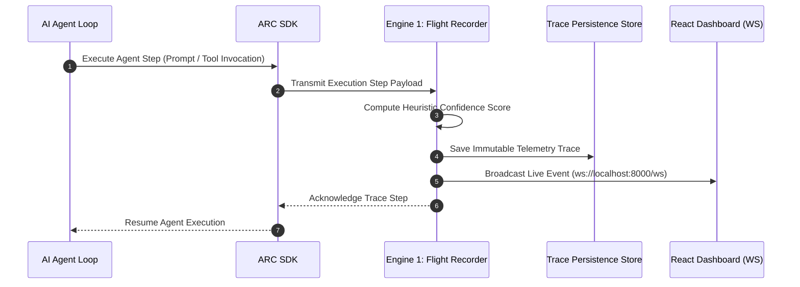
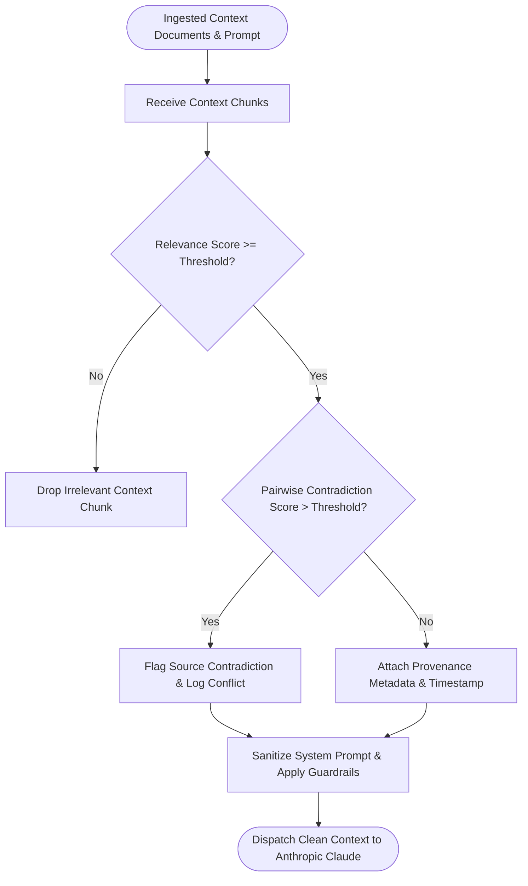
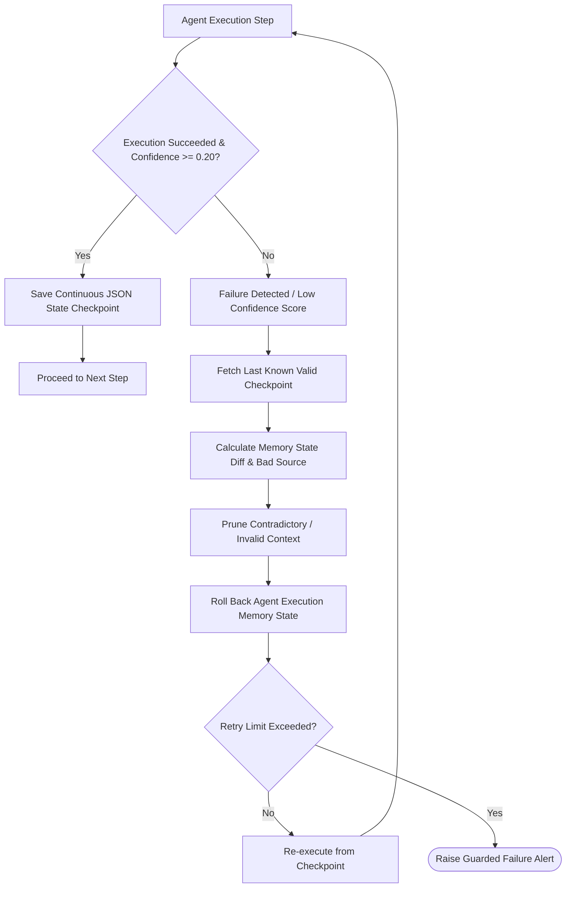
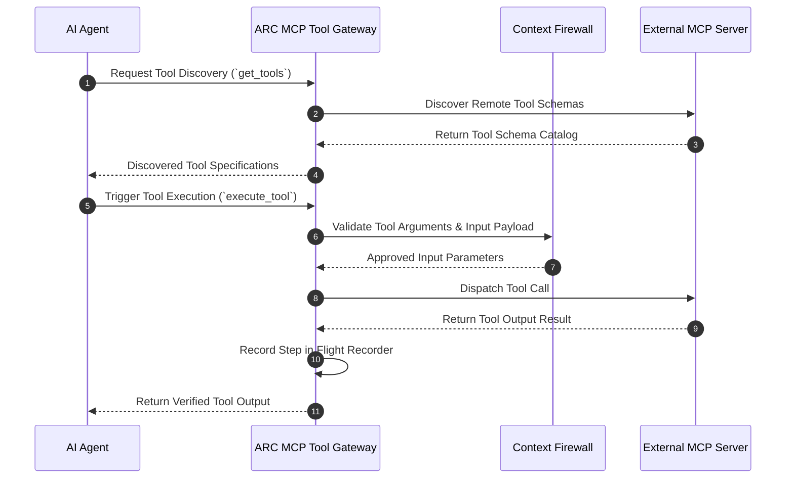
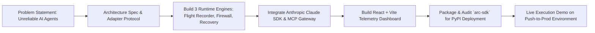

# ARC — Agent Runtime Core

> **The Deterministic Reliability, Telemetry & Security Runtime for AI Agents.**
> *Built for the Push to Prod Hackathon by Anthropic & Elevation Capital.*

[](https://pypi.org/project/arc-sdk/)
[](https://www.python.org/)
[](https://opensource.org/licenses/MIT)
[](https://devfolio.co/)
[](https://www.anthropic.com/)
[](https://www.elevationcapital.com/)
[](https://basecamp.in/)

---

## 🏆 Push to Prod Hackathon: Building at the Frontier

> [!IMPORTANT]
> **ARC** was conceptualized, architected, and built during **Push to Prod: Building at the Frontier** (August 8, 2026), a high-energy in-person hackathon hosted by **Anthropic** and **Elevation Capital** as part of **Basecamp, Bengaluru**—a week-long community-led tech festival running from August 6th to 12th, 2026.

### 📅 Event Brief
| Parameter | Detail |
| :--- | :--- |
| **Event Name** | Push to Prod: Building at the Frontier |
| **Organizers** | **Anthropic** & **Elevation Capital** |
| **Festival** | Basecamp Bengaluru (August 6th – 12th, 2026) |
| **Hackathon Date** | **August 8th, 2026** |
| **Format** | 5-Hour Focused In-Person Build & Prototype Sprint |
| **Core AI Stack** | **Anthropic Claude 3.7 Sonnet** & Anthropic Python SDK |

---

### 🎯 Theme Alignment: "Build the Next Audacious"

| Audacious Pillar | Hackathon Challenge Definition | How ARC Answers The Call |
| :--- | :--- | :--- |
| 🚀 **Build the Next Frontier Capability** | *A new capability, architecture, or approach that doesn't exist yet, not a repackaging of existing tools.* | ARC introduces **deterministic agent runtime protection**: real-time pairwise context conflict detection, immutable execution flight recording, and self-healing memory diff rollbacks. |
| 💰 **Build the Next Billion Dollar Idea** | *A product with a believable path to massive scale and value on its own. Not a feature bolted onto existing workflows.* | ARC is the **reliability & security middleware layer** for every enterprise deploying AI agents. As agent deployments scale from thousands to millions of tool calls, ARC provides the non-negotiable runtime safety net. |
| 🔄 **Redefine a Category** | *Something that makes today’s default way of doing a thing look outdated. A different way of solving the problem entirely.* | Today's agent building relies on brittle trial-and-error retry loops. ARC replaces unmonitored execution with **black-box telemetry replay, context firewalling, and deterministic state checkpointing**. |
| 🖥️ **The Interface That Doesn't Exist Yet** | *A new way of interacting with technology. Not another app on a screen.* | ARC delivers the **Agent Flight Recorder Dashboard**—a dynamic telemetry interface visualizing agent thought graphs, pairwise document conflicts, and state diff rollbacks in real time. |
| 🏗️ **Infrastructure Everyone Else Will Build On** | *The layer other products and companies will depend on in five years.* | ARC is built as **provider-agnostic, open-source middleware** with drop-in support for **Anthropic Claude**, Model Context Protocol (MCP) servers, LangGraph, CrewAI, AutoGen, and OpenHands. |

---

## 👥 Team & Official Repositories

> [!NOTE]
> The ARC project comprises the core runtime engine, SDK, control plane, developer dashboard, and dedicated agent runtime execution environments.

### 👥 Team Members
- **Vishal Lakshmikanthan** — GitHub: [@Vishallakshmikanthan](https://github.com/Vishallakshmikanthan)
- **Sneha C** — GitHub: [@CSNEHA20](https://github.com/CSNEHA20)

### 🔗 Official Repositories
* 📦 **Core Runtime & Control Plane Repository**: [https://github.com/Vishallakshmikanthan/agent-runtime-core](https://github.com/Vishallakshmikanthan/agent-runtime-core)
* 🧪 **Agent Execution Environment Repository**: [https://github.com/CSNEHA20/Push-to-prod_agent-runtime-environment](https://github.com/CSNEHA20/Push-to-prod_agent-runtime-environment)
* 🐍 **PyPI Package Index**: [`arc-sdk v0.1.0`](https://pypi.org/project/arc-sdk/)

---

## 📸 Developer Dashboard Overview


---

## 📌 Submission Summary & Feature Matrix

| Feature / Metric | Implementation & Description |
| :--- | :--- |
| **Project Name** | **ARC (Agent Runtime Core)** |
| **Tagline** | The missing deterministic reliability, telemetry & security layer for AI Agents. |
| **PyPI Package** | [`arc-sdk v0.1.0`](https://pypi.org/project/arc-sdk/) (`pip install arc-sdk`) |
| **Direct Git Install** | `pip install git+https://github.com/Vishallakshmikanthan/agent-runtime-core.git#subdirectory=arc-sdk` |
| **Claude Integration** | Native transparent interception for `anthropic.Anthropic()` and `client.messages.create()` / `stream()` |
| **Engine 1: Flight Recorder** | Real-time step tracing, confidence heuristics, WebSocket streaming, and visual timeline replay. |
| **Engine 2: Context Firewall** | Vector/TF-IDF relevance filtering, pairwise document contradiction matrix, and prompt injection defense. |
| **Engine 3: Recovery Engine** | Automated continuous state checkpointing, state diff computation, context pruning, and guarded rollbacks. |
| **Protocol Support** | Native **Model Context Protocol (MCP)** tool discovery, validation, and execution proxying. |

---

## ⚡ Quickstart & Installation

### Option 1: Install via PyPI (Recommended)
```bash
pip install arc-sdk
```

### Option 2: Direct GitHub Installation (Latest Commit)
```bash
pip install git+https://github.com/Vishallakshmikanthan/agent-runtime-core.git#subdirectory=arc-sdk
```

### Option 3: Local Developer Setup
```bash
git clone https://github.com/Vishallakshmikanthan/agent-runtime-core.git
cd agent-runtime-core/arc-sdk
pip install -e .
```

---

## 🤖 Zero-Code Interception with Anthropic Claude SDK

> [!TIP]
> **ARC** provides **zero-friction, drop-in transparent interception** for the native Anthropic Python SDK. You write standard Anthropic code while ARC transparently records telemetry, enforces context firewall rules, and manages failure recovery behind the scenes.

### 1. Standard Claude Message Creation

```python
from anthropic import Anthropic
from arc import ARC

# 1. Initialize standard Anthropic client
raw_client = Anthropic(api_key="your-anthropic-api-key")

# 2. Wrap client with ARC (Zero code changes required downstream!)
client = ARC(raw_client)

# 3. Invoke Claude exactly as you normally would
response = client.messages.create(
    model="claude-3-7-sonnet-20250219",
    max_tokens=1024,
    messages=[
        {"role": "user", "content": "Analyze the attached financial context and extract key growth drivers."}
    ]
)

# Standard Anthropic response objects are returned completely untouched!
print(response.content[0].text)
```

### 2. Streaming & MCP Tool Interception

```python
from anthropic import Anthropic
from arc import ARC

client = ARC(Anthropic(api_key="your-anthropic-api-key"))

# Live response streaming logged to ARC Flight Recorder in real-time
with client.messages.stream(
    model="claude-3-7-sonnet-20250219",
    max_tokens=2048,
    messages=[{"role": "user", "content": "Draft an architectural spec for a distributed queue."}]
) as stream:
    for text in stream.text_stream:
        print(text, end="", flush=True)

# MCP Tool execution protected by Context Firewall
response = client.beta.messages.create(
    model="claude-3-7-sonnet-20250219",
    max_tokens=1024,
    tools=[{
        "name": "query_database",
        "description": "Query internal enterprise database",
        "input_schema": {
            "type": "object",
            "properties": {"sql": {"type": "string"}},
            "required": ["sql"]
        }
    }],
    messages=[{"role": "user", "content": "Find total customer revenue for Q3."}]
)
```

---

## 🎯 The Core Problem & ARC Architecture

### The Problem in Production Agent Deployments
1. **Silent Execution Crashes**: Autonomous agents fail mid-way through multi-step tasks without leaving execution traces or diagnostic state.
2. **Context Contradiction & Hallucination**: RAG pipelines feed unverified, conflicting documents into the context window, causing agents to hallucinate false premises.
3. **Fragile State Management**: A single API rate-limit, bad tool parameter, or schema mismatch forces the entire multi-step agent loop to start over from Step 0.
4. **Unchecked Tool Invocations**: Model Context Protocol (MCP) tool executions lack real-time input verification, payload auditing, and governance.

---

## 🏗️ End-to-End System Architecture

```mermaid
graph TD
    subgraph Agent Tier - Application Layer
        A1[Custom Python Agent Scripts]
        A2[LangGraph Workflows]
        A3[CrewAI / AutoGen Multi-Agent]
        A4[OpenHands Execution Environment]
    end

    subgraph ARC SDK Layer
        SDK[arc-sdk Client / Decorators]
        MID[Framework Interceptor Middleware]
    end

    subgraph ARC Control Plane Gateway - FastAPI Core
        API[REST & WebSocket Gateway]
        
        subgraph Engine 2: Context Firewall
            CF1[TF-IDF / Vector Relevance Scorer]
            CF2[Pairwise Conflict Matrix Resolver]
            CF3[Provenance Tagging Engine]
        end

        subgraph Engine 1: Flight Recorder
            FR1[Asynchronous Step Tracer]
            FR2[Heuristic Confidence Evaluator]
            FR3[Telemetry WebSocket Broadcast Server]
        end

        subgraph Engine 3: Self-Healing Recovery Engine
            RE1[Continuous State Checkpoint Store]
            RE2[State Diff & Conflict Calculator]
            RE3[Context Pruner & Guarded Rollback]
        end

        subgraph Protocol Layer
            MCP[MCP Tool Router Gateway]
        end
    end

    subgraph LLM Intelligence Layer
        P1[Anthropic Adapter - Claude 3.7 Sonnet / Haiku]
        P2[OpenAI Adapter - GPT-4o / o3-mini]
        P3[Gemini Adapter - Gemini 2.0 Flash]
    end

    subgraph External Systems & Infrastructure
        WORLD[Tools / DBs / External APIs / MCP Servers]
    end

    Agent Tier --> SDK
    SDK --> MID
    MID --> API
    API --> CF1
    CF1 --> CF2 --> CF3
    CF3 --> LLM Intelligence Layer
    LLM Intelligence Layer --> P1 & P2 & P3
    P1 & P2 & P3 --> LLM Intelligence Layer
    LLM Intelligence Layer --> FR1
    FR1 --> FR2 --> FR3
    FR3 --> API
    API --> MCP --> WORLD
    API --> RE1 --> RE2 --> RE3
```

---

## 🔄 Runtime Engine Workflows & Technical Flowcharts

### 1. Engine 1: Flight Recorder Sequence Flow



### 2. Engine 2: Context Firewall Flowchart



### 3. Engine 3: Self-Healing Recovery Engine Flowchart



### 4. Model Context Protocol (MCP) Tool Gateway Sequence



### 5. Push to Prod Hackathon Development & Build Loop



---

## 🧰 Technology Stack Matrix

```
====================================================================================
LAYER                   TECHNOLOGY / FRAMEWORK               PURPOSE
====================================================================================
Frontend Dashboard      React 18, Vite, Tailwind CSS         Developer Telemetry UI
                        Lucide React Icons, Recharts         Real-time execution analytics
------------------------------------------------------------------------------------
Control Plane Backend   FastAPI, Uvicorn, Pydantic v2        Provider-Agnostic Gateway
                        SQLAlchemy (Async), SQLite/Postgres  Telemetry & State Store
                        WebSockets, asyncio                  Live telemetry streaming
------------------------------------------------------------------------------------
Python SDK              arc-sdk (v0.1.0), HTTPX              PyPI & Git Installable Package
                        Click, Rich                          Developer CLI (`arc`)
------------------------------------------------------------------------------------
LLM Providers           Anthropic (Claude 3.7 / Haiku)       Core Intelligence Layer
                        OpenAI (GPT-4o / o3-mini)            Provider-Agnostic Support
                        Google Gemini (2.0 Flash)            Multi-Model Support
------------------------------------------------------------------------------------
Framework Adapters      LangGraph, CrewAI, AutoGen,          Middleware Hook Wrappers
                        OpenHands, Custom Python Agents      
------------------------------------------------------------------------------------
Protocols & Standards   Model Context Protocol (MCP)         Standardized Tool Gateway
                        OpenAPI 3.0, WebSockets (v1)         API Specification
====================================================================================
```

---

## 💻 Code Examples & Usage Patterns

### 1. Decorator-Based Function Protection

```python
import arc

# Initialize ARC Runtime Configuration
arc.init(
    server_url="http://localhost:8000",
    provider="anthropic",
    api_key="your-anthropic-api-key"
)

# Protect functions with the @arc.protected decorator
@arc.protected(name="Financial Analyst", task="Extract Revenue Metrics")
def analyze_quarterly_data(ticker: str) -> dict:
    # Input parameters checked by Context Firewall
    # Traces & confidence heuristics logged to Flight Recorder
    return {"ticker": ticker, "revenue_usd": 42000000, "confidence": 0.94}

result = analyze_quarterly_data("AAPL")
print(result)
```

### 2. High-Level Managed Session Execution

```python
from arc_sdk import ARC

arc_client = ARC(endpoint="http://localhost:8000")

# Create a managed recording session
session = arc_client.create_session(
    agent_name="MarketResearchAgent",
    task="Synthesize competitive intelligence report"
)

# Step 1: Filter raw context via Context Firewall
clean_docs = session.filter_context(
    documents=[
        {"id": "doc1", "content": "Company A Q3 revenue was $4.2M"},
        {"id": "doc2", "content": "Company A Q3 revenue was $9.8M"} # Conflicting!
    ],
    relevance_threshold=0.50
)

# Step 2: Record decision step in Flight Recorder
session.record_step(
    step_type="llm_call",
    decision="Detected revenue conflict between sources, requesting primary source audit",
    confidence=0.88
)

# Step 3: Save execution state checkpoint for Recovery Engine
session.checkpoint(state={"step": 2, "verified_docs": clean_docs})
```

---

## 📂 Repository File Structure

```
agent-runtime-core/
├── arc/
│   ├── backend/                     # FastAPI Control Plane Gateway
│   │   ├── api/                     # REST & WebSocket Route Handlers
│   │   ├── core/                    # Engine Core Logics
│   │   │   ├── flight_recorder.py   # Engine 1: Telemetry & Tracing
│   │   │   ├── context_firewall.py  # Engine 2: Security & Conflict Resolver
│   │   │   ├── recovery_engine.py   # Engine 3: Checkpointing & State Diffs
│   │   │   └── arc_runtime.py       # Master Runtime Manager
│   │   ├── db/                      # SQLAlchemy Async Engine & Models
│   │   ├── main.py                  # Backend Gateway Entrypoint
│   │   └── requirements.txt
│   ├── frontend/                    # Developer Dashboard (React 18 + Vite)
│   │   ├── src/
│   │   │   ├── components/          # Replay, Firewall, Recovery & Analytics Views
│   │   │   ├── App.jsx
│   │   │   └── index.css
│   │   ├── package.json
│   │   └── vite.config.js
│   ├── sdk/                         # Local Python SDK Source
│   │   └── arc_sdk/
│   └── demo/                        # Interactive Demo & Chaos Injector
│       └── demo_agent.py
├── arc-sdk/                         # Published PyPI & Git Package Source
│   ├── arc/                         # Top-Level Module Namespace (`import arc`)
│   │   ├── providers/               # Anthropic, OpenAI, Gemini Adapters
│   │   ├── integrations/            # LangGraph, CrewAI, AutoGen, OpenHands, MCP
│   │   ├── runtime/                 # Lightweight Runtime Engines
│   │   └── cli/                     # CLI Executable (`arc`)
│   └── pyproject.toml
├── ptp_ss/                          # System Screenshots & Visual Posters
├── docs/                            # Architectural Specs & API Documentation
├── PROJECT.md                       # Master Architecture Single Source of Truth
├── ARCHITECTURE.md                  # Engine & Middleware Specs
├── API_SPEC.md                      # REST & WebSocket API Specs
├── SDK_SPEC.md                      # SDK Interface Specs
├── TODO.md                          # Implementation Roadmap & Tracker
└── README.md                        # Production Documentation
```

---

## 🖼️ Telemetry & Developer Dashboard Showcase

### 1. Master System Poster & Vision


### 2. Dashboard Overview & Active Sessions


*Real-time active agent session monitoring, execution health graphs, confidence distributions, and session step counters.*

### 3. Engine 1: Flight Recorder Visual Timeline Replay


*Step-by-step visual replay timeline displaying exact prompts, model responses, tool calls, and heuristic confidence scores.*

### 4. Engine 2: Context Firewall Security Graph & Pairwise Matrix


*Interactive graph displaying context relevance scores, pairwise contradiction flags, prompt injection alerts, and provenance metadata.*

### 5. Engine 3: Self-Healing Failure Recovery State Diffs


*Visual state diff viewer highlighting memory state changes, pruned context chunks, and target rollback checkpoints.*

### 6. Comprehensive Telemetry & Analytics

*System telemetry metrics displaying total tokens processed, memory overhead, latency percentiles, and recovery success rates.*

---

## 🧪 Testing & Verification

ARC includes a comprehensive PyTest test suite covering unit, integration, provider adapter, and engine logic tests:

```bash
# Run backend test suite
cd arc/backend
pytest -v

# Run SDK test suite
cd arc-sdk
pytest -v
```

---

## 📜 License & Acknowledgments

Distributed under the **MIT License**. See `LICENSE` for details.

### 🙏 Special Thanks
Built with ❤️ during **Push to Prod: Building at the Frontier** (August 8, 2026) organized by:
* **Anthropic**
* **Elevation Capital**
* **Basecamp, Bengaluru**
