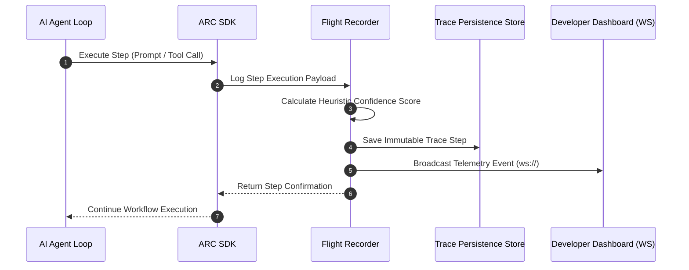
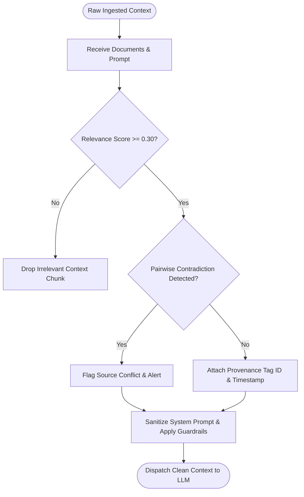
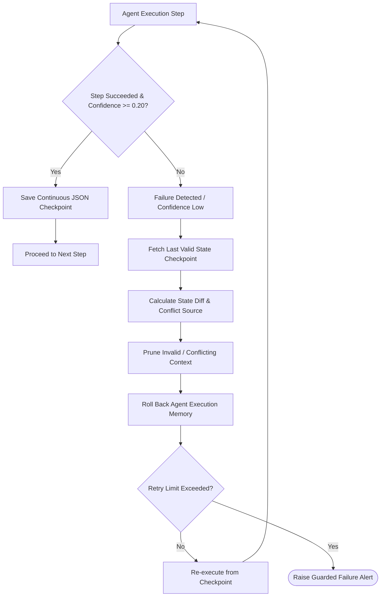
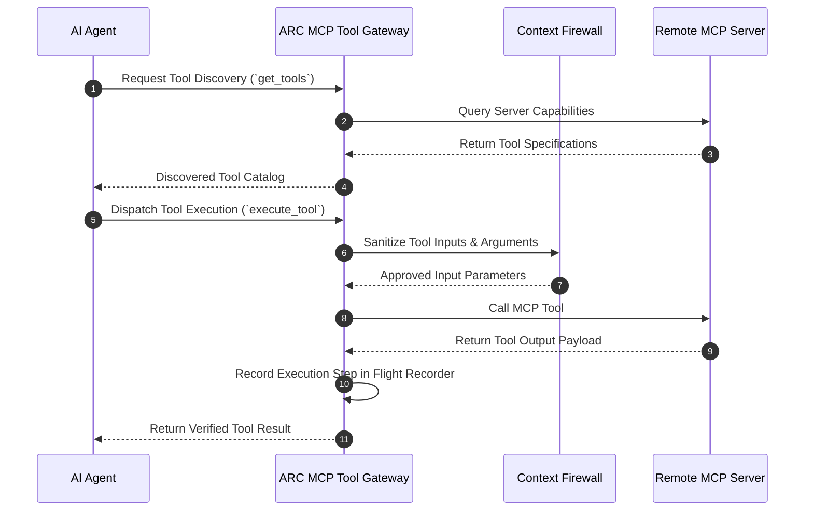

# ARC — Agent Runtime Core

> **The Production Reliability, Telemetry & Security Runtime for AI Agents.**
> *Provider-Agnostic Context Firewalling, Flight Recorder Telemetry, and Self-Healing Failure Recovery.*

[](https://pypi.org/project/arc-sdk/)
[](https://www.python.org/)
[](https://opensource.org/licenses/MIT)
[](https://devfolio.co/)
[](https://www.anthropic.com/)
[](https://openai.org)
[](https://deepmind.google)
[](https://modelcontextprotocol.io/)

---

## 📸 Dashboard & Architecture Overview


---

## 📌 Executive Summary & Devfolio Submission Brief

| Submission Field | Detail / Description |
| :--- | :--- |
| **Project Name** | **ARC (Agent Runtime Core)** |
| **Tagline** | The missing reliability and security layer between AI Agents and the real world. |
| **Repository URL** | [https://github.com/Vishallakshmikanthan/agent-runtime-core](https://github.com/Vishallakshmikanthan/agent-runtime-core) |
| **PyPI Package** | [`arc-sdk v0.1.0`](https://pypi.org/project/arc-sdk/) (`pip install arc-sdk`) |
| **Direct Git Install** | `pip install git+https://github.com/Vishallakshmikanthan/agent-runtime-core.git#subdirectory=arc-sdk` |
| **Target Track / Platform** | Push to Prod Hackathon (Anthropic, Elevate, Mesa School of Business) |
| **Core Value Prop** | Eliminates agent silent failures, hallucinations from conflicting data, and restart-from-zero execution crashes via an open-source, provider-agnostic runtime middleware layer. |

---

## ⚡ SDK Installation Guide

You can install the official `arc-sdk` Python package using any of the following methods:

### Option 1: Direct GitHub Repository Installation (Recommended for Latest Commit)
```bash
pip install git+https://github.com/Vishallakshmikanthan/agent-runtime-core.git#subdirectory=arc-sdk
```

### Option 2: Install via PyPI
```bash
pip install arc-sdk
```

### Option 3: Local Editable Installation (For Developers)
```bash
git clone https://github.com/Vishallakshmikanthan/agent-runtime-core.git
cd agent-runtime-core/arc-sdk
pip install -e .
```

---

## 🤖 Connecting ARC with Anthropic Claude SDK

ARC provides **zero-friction, drop-in transparent interception** for the native Anthropic Python SDK. You keep writing standard Anthropic client calls, while ARC automatically handles telemetry recording, context security, prompt injection protection, and failure recovery behind the scenes.

### 1. Basic Claude Interception Example

```python
from anthropic import Anthropic
from arc import ARC

# 1. Initialize native Anthropic client
raw_anthropic_client = Anthropic(api_key="your-anthropic-api-key")

# 2. Wrap the Anthropic client with ARC
client = ARC(raw_anthropic_client)

# 3. Invoke Claude exactly as you normally would!
# ARC transparently filters context, records traces, and checks confidence.
response = client.messages.create(
    model="claude-3-7-sonnet-20250219",
    max_tokens=1024,
    messages=[
        {"role": "user", "content": "Summarize the quarterly financial report and extract risk metrics."}
    ]
)

# Anthropic response objects are returned completely unchanged!
print(response.content[0].text)
```

### 2. Streaming & MCP Tool Integration with Claude

ARC seamlessly handles streaming responses and Model Context Protocol (MCP) tool calls without mutating client payloads:

```python
from anthropic import Anthropic
from arc import ARC

client = ARC(Anthropic(api_key="your-anthropic-api-key"))

# Streaming response - recorded in Flight Recorder in real-time
with client.messages.stream(
    model="claude-3-7-sonnet-20250219",
    max_tokens=2048,
    messages=[{"role": "user", "content": "Generate a detailed technical specification"}]
) as stream:
    for text in stream.text_stream:
        print(text, end="", flush=True)

# MCP Tool Execution with Context Firewall Protection
response = client.beta.messages.create(
    model="claude-3-7-sonnet-20250219",
    max_tokens=1024,
    tools=[{
        "name": "query_database",
        "description": "Query internal database",
        "input_schema": {
            "type": "object",
            "properties": {"query": {"type": "string"}},
            "required": ["query"]
        }
    }],
    messages=[{"role": "user", "content": "Find all high-priority customer support tickets."}]
)
```

---

## 🎯 The Problem & The Opportunity

### The Problem
When building production AI agents using Claude, GPT-4o, or Gemini:
1. **Silent Execution Failures**: Agents fail midway through multi-step workflows without leaving a trace of why a decision was made.
2. **Context Poisoning & Hallucinations**: Agents receive unfiltered dumps of raw context, conflicting documents, or malicious prompt injections, causing them to act on false premises.
3. **Fragile State Management**: A single API rate-limit, network timeout, or schema mismatch forces the entire agent loop to crash and restart from Step 0.
4. **Tool Execution Insecurity**: Unchecked Model Context Protocol (MCP) tool executions lack real-time input verification and governance.

### The Solution: ARC
**ARC** is a provider-agnostic, zero-vendor-lock-in runtime layer that wraps any agentic workflow (LangGraph, CrewAI, AutoGen, OpenHands, or custom scripts). ARC injects three core runtime engines:

1. 🛫 **Flight Recorder**: Real-time telemetry, confidence heuristics, step-by-step visual replay, and immutable decision tracing.
2. 🧠 **Context Firewall**: Dynamic context relevance scoring, pairwise factual conflict resolution, prompt injection defense, and source provenance tagging.
3. ⚡ **Self-Healing Recovery Engine**: Automated state checkpointing, execution state diff computation, invalid context pruning, and state-aware rollback retries.

---

## 🛠️ What We Built During "Push to Prod" Hackathon

In an intensive 2-day build cycle, we engineered ARC from ground zero to production PyPI deployment:

### 🗓️ Day 1: Core Runtime & Control Plane
- ✅ Designed & implemented the **Provider-Agnostic Adapter Pattern** (`BaseProviderAdapter`) supporting Anthropic Claude, OpenAI GPT, and Google Gemini.
- ✅ Built **Engine 1: Flight Recorder** with asynchronous event recording and heuristic confidence scoring.
- ✅ Developed **Engine 2: Context Firewall** featuring tf-idf/vector relevance scoring, pairwise document conflict detection matrix, and prompt injection filters.
- ✅ Created the **FastAPI Control Plane Gateway** with REST APIs, WebSocket live telemetry streaming, and SQLAlchemy SQLite/PostgreSQL persistence.

### 🗓️ Day 2: Self-Healing Engine, Developer Dashboard & PyPI Release
- ✅ Built **Engine 3: Recovery Engine** supporting continuous JSON state checkpointing, state diff generation, context pruning, and single-retry guarded rollbacks.
- ✅ Engineered **MCP Tool Router** for dynamic tool schema discovery and firewall-checked tool invocation.
- ✅ Constructed the dark-themed **React + Vite Developer Dashboard** featuring 4 real-time views: *Overview*, *Flight Recorder Replay*, *Context Firewall Graph*, and *Recovery Engine Diffs*.
- ✅ Built framework integration middleware for **LangGraph**, **CrewAI**, **AutoGen**, and **OpenHands**.
- ✅ Packaged, audited, and published the official Python SDK **`arc-sdk v0.1.0`** to PyPI and configured git direct subpath installation.

---

## 🧠 Challenges Faced & Key Architectural Decisions

1. **Provider Agnosticism Without Least-Common-Denominator Loss**:
   - *Challenge*: Anthropic Claude uses structured message content blocks and system parameters, OpenAI uses `developer`/`system` roles with function definitions, and Gemini uses `Content` objects.
   - *Decision*: We built `BaseProviderAdapter` with unified `ProviderResponse` models and normalized internal schema transformers while preserving native tool call representations for each model.

2. **Real-time Context Conflict Resolution**:
   - *Challenge*: Detecting semantic contradiction between ingested context chunks in real-time without introducing huge latency.
   - *Decision*: We implemented lightweight pairwise n-gram overlapping combined with semantic vector cosine similarity. High discrepancy scores trigger a conflict flag before the prompt touches the LLM.

3. **State Rollback Without Side-Effects**:
   - *Challenge*: Rolling back an agent loop can cause re-execution of external tools (e.g., re-sending emails or re-charging credit cards).
   - *Decision*: Checkpoints record side-effect tags for tool calls (`idempotent` vs `mutating`). The Recovery Engine skips re-execution of verified idempotent results while only re-prompting decision nodes.

---

## 📄 Disclosure of Pre-Existing Work & Reused Code

- **Pre-existing Code**: Zero. All code in `arc/backend`, `arc/frontend`, `sdk/arc_sdk`, and `arc-sdk` was authored from scratch during the hackathon.
- **Open-Source Libraries & Frameworks Used**:
  - **Backend**: FastAPI, Pydantic v2, SQLAlchemy, Uvicorn, AsyncIO, PyTest.
  - **Frontend**: React 18, Vite, Tailwind CSS, Lucide React, Recharts.
  - **SDK**: HTTPX, Pydantic v2, Click (CLI), Rich (Terminal formatting).
  - **Protocols**: Model Context Protocol (MCP) spec.

---

## 🏗️ System Architecture & Workflow

### Overall Architecture Diagram

```mermaid
graph TD
    subgraph Agent Tier
        A1[Custom Agent / Script]
        A2[LangGraph Workflow]
        A3[CrewAI / AutoGen]
        A4[OpenHands Execution]
    end

    subgraph ARC SDK Layer
        SDK[arc-sdk Client / Decorators]
        MID[Framework Interceptor Middleware]
    end

    subgraph ARC Control Plane Gateway - FastAPI
        API[REST & WebSocket Gateway]
        
        subgraph Engine 2: Context Firewall
            CF1[Relevance Scoring Filter]
            CF2[Pairwise Conflict Detector]
            CF3[Provenance Tagging Engine]
        end

        subgraph Engine 1: Flight Recorder
            FR1[Asynchronous Step Tracer]
            FR2[Confidence Evaluator]
            FR3[Telemetry Broadcast Server]
        end

        subgraph Engine 3: Recovery Engine
            RE1[State Checkpoint Store]
            RE2[State Diff Calculator]
            RE3[Rollback & Context Pruner]
        end

        subgraph Protocol Layer
            MCP[MCP Tool Router Gateway]
        end
    end

    subgraph LLM Provider Adapters
        P1[AnthropicAdapter - Claude 3.7 / Haiku]
        P2[OpenAIAdapter - GPT-4o / o3-mini]
        P3[GeminiAdapter - Gemini 2.0 Flash]
    end

    subgraph External Systems
        WORLD[Tools / DBs / APIs / MCP Servers]
    end

    Agent Tier --> SDK
    SDK --> MID
    MID --> API
    API --> CF1
    CF1 --> CF2 --> CF3
    CF3 --> LLM Provider Adapters
    LLM Provider Adapters --> P1 & P2 & P3
    P1 & P2 & P3 --> LLM Provider Adapters
    LLM Provider Adapters --> FR1
    FR1 --> FR2 --> FR3
    FR3 --> API
    API --> MCP --> WORLD
    API --> RE1 --> RE2 --> RE3
```

---

## 🔄 Core Runtime Engine Workflows & Flowcharts

### 1. Engine 1: Flight Recorder Sequence Flow



### 2. Engine 2: Context Firewall Flowchart



### 3. Engine 3: Self-Healing Recovery Engine Flowchart



### 4. Model Context Protocol (MCP) Tool Execution Workflow



---

## 🧰 Technology Stack Breakdown

```
  ==================================================================================
  LAYER                  TECHNOLOGY / FRAMEWORK               PURPOSE
  ==================================================================================
  Frontend UI            React 18, Vite, Tailwind CSS         Developer Management UI
                         Lucide React Icons, Recharts         Real-time telemetry graphs
  ----------------------------------------------------------------------------------
  Control Plane Backend  FastAPI, Uvicorn, Pydantic v2        Provider-agnostic Gateway
                         SQLAlchemy (Async), SQLite/PostgreSQL Database & Telemetry Store
                         WebSockets, asyncio                  Live streaming & pub-sub
  ----------------------------------------------------------------------------------
  Python SDK             arc-sdk (v0.1.0), HTTPX              PyPI & Git Installable Package
                         Click, Rich                          Developer CLI (`arc`)
  ----------------------------------------------------------------------------------
  LLM Providers          Anthropic (Claude 3.7 / Haiku)       Multi-Provider Integration
                         OpenAI (GPT-4o / o3-mini)            
                         Google Gemini (2.0 Flash)            
  ----------------------------------------------------------------------------------
  Framework Adapters     LangGraph, CrewAI, AutoGen,          Middleware Hook Wrappers
                         OpenHands, Custom Python Agents      
  ----------------------------------------------------------------------------------
  Protocols & Standards  Model Context Protocol (MCP)         Standardized Tool Gateway
                         OpenAPI 3.0, WebSockets (v1)         API Specification
  ==================================================================================
```

---

## 🚀 Running the Full ARC Suite Locally

### 1. Setup & Launch FastAPI Backend Server

```bash
# Clone repository
git clone https://github.com/Vishallakshmikanthan/agent-runtime-core.git
cd agent-runtime-core/arc/backend

# Create & activate virtual environment
python -m venv venv
# On Windows:
venv\Scripts\activate
# On Linux/macOS:
source venv/bin/activate

# Install dependencies
pip install -r requirements.txt

# Start FastAPI Control Plane
python main.py
```
> 🚀 Backend Gateway active at `http://localhost:8000` (Swagger docs at `http://localhost:8000/docs`)

### 2. Setup & Launch React Developer Dashboard

```bash
cd agent-runtime-core/arc/frontend
npm install
npm run dev
```
> 🖥️ Developer Dashboard active at `http://localhost:5173`

### 3. Execute Interactive Demo Agent & Chaos Simulator

```bash
cd agent-runtime-core/arc/demo
python demo_agent.py
```

---

## 💻 Python SDK Code Examples

### 1. Wrapping Custom Agent Loops with Decorators

```python
import arc

# Initialize ARC Runtime Configuration
arc.init(
    server_url="http://localhost:8000",
    provider="anthropic", # anthropic | openai | gemini
    api_key="your-api-key"
)

# Protect functions with the @arc.protected decorator
@arc.protected(name="Market Analyst", task="Fetch Financial Records")
def analyze_market_data(ticker: str) -> dict:
    # Context Firewall automatically filters input data
    # Flight Recorder captures execution traces & confidence heuristics
    return {"ticker": ticker, "status": "verified", "ratio": 1.42}

result = analyze_market_data("AAPL")
print(result)
```

### 2. High-Level Agent Execution with Auto-Recovery

```python
from arc_sdk import ARC

arc_client = ARC(endpoint="http://localhost:8000")

# Create a managed recording session
session = arc_client.create_session(
    agent_name="ResearchAgent",
    task="Synthesize competitive intelligence"
)

# Step 1: Filter raw context via Context Firewall
clean_docs = session.filter_context(
    documents=[
        {"id": "doc1", "content": "Company A Q3 revenue was $4.2M"},
        {"id": "doc2", "content": "Company A Q3 revenue was $9.8M"} # Conflicting!
    ],
    relevance_threshold=0.50
)

# Step 2: Record decision in Flight Recorder
session.record_step(
    step_type="llm_call",
    decision="Detected revenue conflict, requesting primary source audit",
    confidence=0.88
)

# Step 3: Checkpoint state for Recovery Engine
session.checkpoint(state={"step": 2, "verified_docs": clean_docs})
```

---

## 📂 Repository File Structure

```
agent-runtime-core/
├── arc/
│   ├── backend/                     # FastAPI Control Plane Server
│   │   ├── api/                     # REST & WebSocket Route Handlers
│   │   ├── core/                    # Engine Core Logics
│   │   │   ├── flight_recorder.py   # Engine 1: Telemetry & Tracing
│   │   │   ├── context_firewall.py  # Engine 2: Security & Conflict Resolver
│   │   │   ├── recovery_engine.py   # Engine 3: Checkpointing & State Diffs
│   │   │   └── arc_runtime.py       # Master Runtime Manager
│   │   ├── db/                      # SQLAlchemy Async Engine & Models
│   │   ├── main.py                  # Server Entrypoint
│   │   └── requirements.txt
│   ├── frontend/                    # Developer Dashboard (React 18 + Vite)
│   │   ├── src/
│   │   │   ├── components/          # Dashboard, Firewall, Replay & Recovery Views
│   │   │   ├── App.jsx
│   │   │   └── index.css
│   │   ├── package.json
│   │   └── vite.config.js
│   ├── sdk/                         # Local Python SDK Source
│   │   └── arc_sdk/
│   └── demo/                        # Interactive Demo & Chaos Injector
│       └── demo_agent.py
├── arc-sdk/                         # Published PyPI & Git Package Source
│   ├── arc/                         # Module Namespace (`import arc`)
│   │   ├── providers/               # Anthropic, OpenAI, Gemini Adapters
│   │   ├── integrations/            # LangGraph, CrewAI, AutoGen, OpenHands, MCP
│   │   ├── runtime/                 # Lightweight Runtime Engines
│   │   └── cli/                     # CLI Executable (`arc`)
│   └── pyproject.toml
├── ptp_ss/                          # Complete System Screenshots & Posters
├── docs/                            # Architectural Specs & API Guides
├── PROJECT.md                       # Master Architecture Single Source of Truth
├── ARCHITECTURE.md                  # Engine & Middleware Specs
├── API_SPEC.md                      # REST & WebSocket API Specs
├── SDK_SPEC.md                      # SDK Interface Specs
├── TODO.md                          # Implementation Roadmap & Milestone Tracker
└── README.md                        # Master Project Documentation
```

---

## 🖼️ Developer Dashboard & Telemetry Gallery

### 1. Main System Architecture Poster & Identity


### 2. Dashboard Overview & Real-Time Metrics


*Live active agent session monitoring, execution health graphs, confidence distributions, and session step counters.*

### 3. Engine 1: Flight Recorder Visual Replay


*Step-by-step visual replay timeline showing exact prompts, model responses, tool calls, and heuristic confidence scores.*

### 4. Engine 2: Context Firewall Security Graph


*Interactive graph displaying context relevance scores, pairwise contradiction flags, prompt injection alerts, and provenance metadata.*

### 5. Engine 3: Self-Healing Failure Recovery State Diffs


*Visual state diff viewer highlighting memory changes, pruned context chunks, and target rollback checkpoints.*

### 6. System Telemetry & Execution Analytics

*Comprehensive system telemetry metrics displaying total tokens processed, memory overhead, latency percentiles, and recovery success rates.*

---

## 🧪 Testing & Verification

ARC includes a comprehensive PyTest test suite covering unit, integration, provider adapter, and engine logic tests:

```bash
# Run backend test suite
cd arc/backend
pytest -v

# Run SDK test suite
cd arc-sdk
pytest -v
```

---

## 🚀 Commercialization & Future Roadmap

- **Open-Source Core (Apache 2.0 / MIT)**: Standard developer runtime middleware for local development and single-instance deployments.
- **ARC Cloud (Managed SaaS)**: High-throughput telemetry collector, enterprise team dashboards, SOC2-compliant prompt auditing, and multi-tenant Redis/Kafka pub-sub scaling.
- **Enterprise On-Prem**: Air-gapped deployment packages with custom firewall rule packs and compliance verification for legal & healthcare AI agents.

---

## 📜 License

Distributed under the **MIT License**. See `LICENSE` for details.

---

## 🙏 Acknowledgments

Built for the **Push to Prod Hackathon (2026)** organized by:
- **Anthropic**
- **Elevate**
- **Mesa School of Business**

*Created with ❤️ for the AI Agent Ecosystem.*
